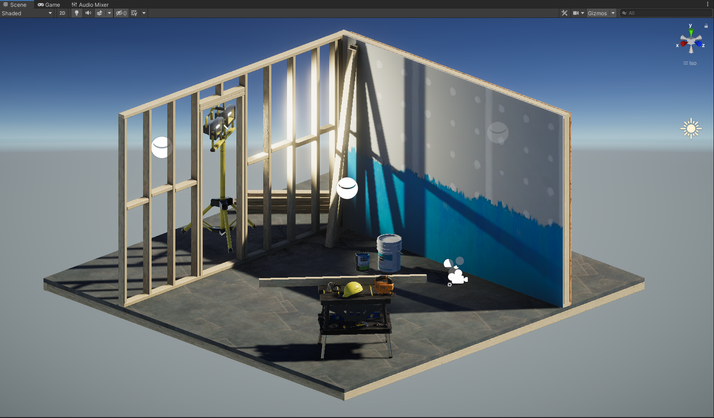

# VR-2020-Demos
Demo scenes for VR class 2020. Scenes are in the Assets/VR/Scenes folder.

# Project 1

A simple physics scene. Click on the screen to toss balls at physics objects.

# Project 2

A visual demo scene based off the Unity sample scene. Click on the Demo object to access buttons controlling various rendering settings.
